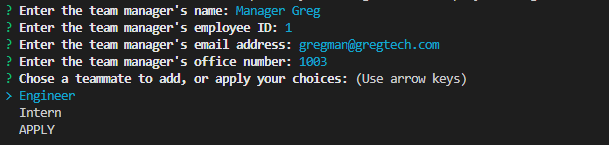
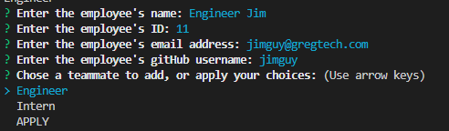
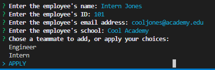
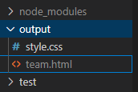
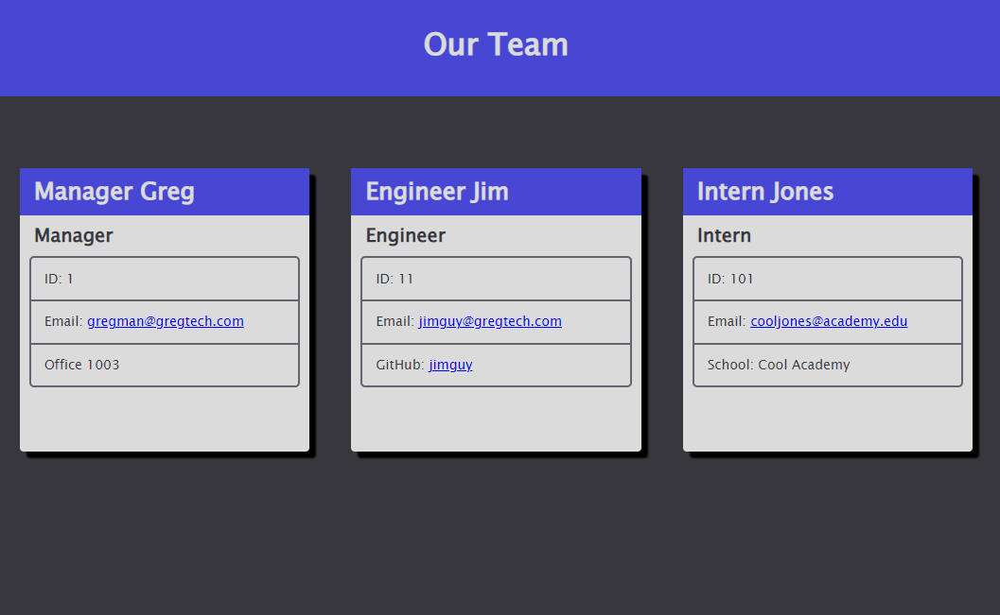

# Week 10: Team Manager

## Description

For the 10th week in our coding bootcamp, we were tasked to create an application that could take in and organize a team of employees into a styled HTML document. We were to use Inquirer functions in order to input the data, and utilize Javascript classes to reduce redundancies in our script. Our classes and functions were to also pass a number of Jest tests.

This assignment builds off of the practice we got in our previous challenge, as it more or less accomplishes the same goal of writing Inquirer prompts to a document using FS. So aside from the task of setting up Inquirer prompt data collection, there were two main challenges to overcome. The first was using Javascript classes to extend the Manager, Engineer, Intern classes from a base Employee class. After reading the documentation and figuring out that methods can be directly overwritten in **extend** statements, this proved to be pretty intuitive. This assignment was a very good demonstration on how constructors, classes, and extending those classes can save a developer a lot of time.

The second challenge was to find a way to efficiently branch and loop Inquirer prompts. When looking into it, Inquirer is a bit finicky when it comes to branching paths in a singular prompt. It is possible technically, but for our application, it made much more sense to split the Inquirer prompts into four main functions. An initializer prompt where you enter the manager's information, a brancher function that can either run a distinct prompt based on a multiple choice question, or apply the current team, and a unique prompt function to enter an Intern or Engineer's information respectively. Because we only need to return an employee object at the end of each employee prompt, and not return anything at the end of all user input, breaking each object into its own prompt made the most sense.

We were also required to run Jest tests on a few scripts, and I even found myself setting up tests to make sure individual functions in html-gen.js returned a desired response. Setting up the tests are fairly simple, and I imagine as the course goes on we'll find more meaningful and impactful ways to use Jest. Testing a single point or series of functions in a much larger function will definitely be useful when building programs that are much larger in scope.

## Installation

Once the repo is cloned to your machine, run **npm i** to install dependencies, notably Jest and Inquirer.

To run the program, open index.js in an integrated terminal and run **node index.js**.

## Usage

- After starting the program, you will be presented with an initial prompt to fill out a team manager's information.

- After submitting all that team member's information, you will have the option to add an Engineer, Intern, or to APPLY your current team.

- Once you have entered all the team members you want, apply the current team.

- This will generate an HTML document in the **output** folder.

- The **output** folder comes with a stylesheet that will be applied to the generated HTML.

- Previewing the document will display the team you entered, with each member having their own card.

## Testing

To run tests after having installed Jest, enter **npm run test** in the terminal.

NOTE: To run tests for html-gen.js, comment out the current makeCard function and the currently exported class. Then uncomment the test class at the bottom of the document.

## License 

Standard MIT license, coursework.